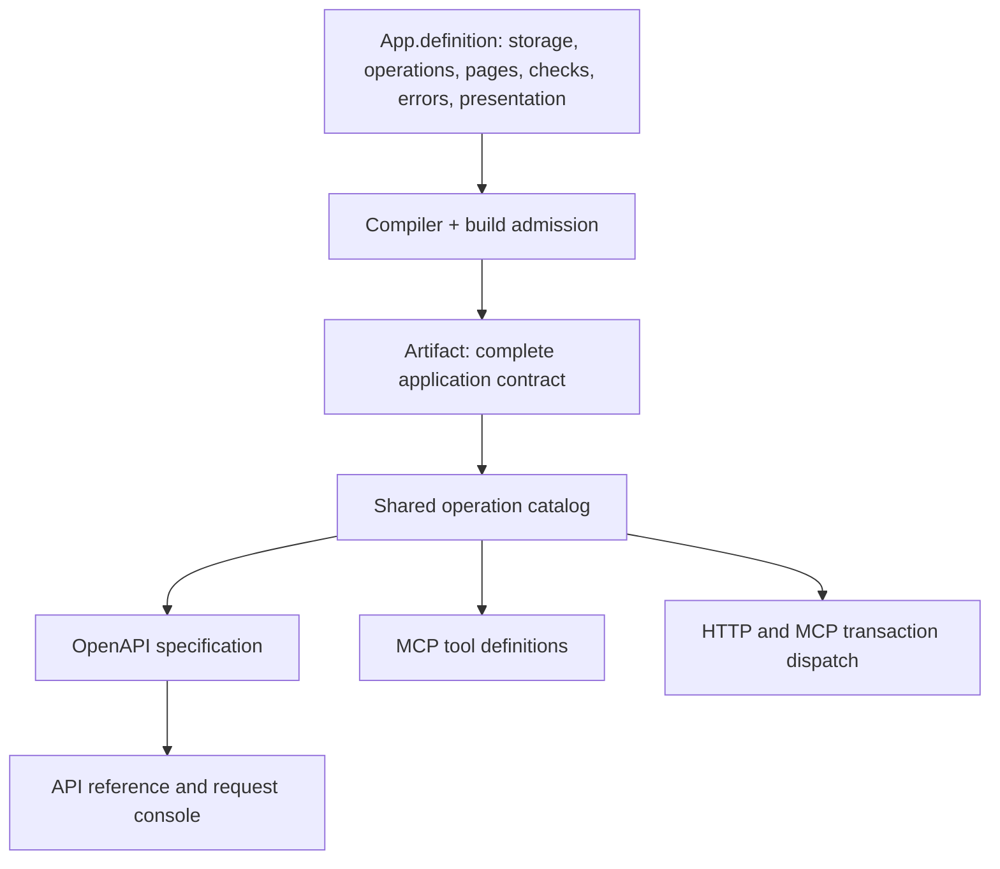

# Shared operation contracts and MCP

Every app served by `serve-local` has a session-authenticated MCP endpoint at
`/mcp`. The host prints `mcp_url` alongside its origin and one-time sign-in URL.
No app server implementation or generated server source needs to be maintained.

## One required application definition



The source of truth is [Reports App.roc](../examples/reports/App.roc).
Each command or query is one field of its `operations` record. Its
`Api.command` or `Api.query` value requires the handler, structured contract,
and typed verification. Commands also require executable effect bounds and any
revision precondition. `Handler` describes optional preparation and external
effects within those same operations. Internal commands and private completions
do not become public tools. See [COMMAND-RUNTIME.md](COMMAND-RUNTIME.md).

Each operation owns its meaning and verification beside its handler; see
[SubmitReport.roc](../examples/reports/commands/submit/SubmitReport.roc). App imports the
complete definition. There is no separate metadata inventory or production
dependency on a fixture. Adding a field to a public input/result requires
updating its exact description record and typed examples. See the
[application layout](APP-LAYOUT.md) for module organization.

`Api.Usage` supplies purpose, use/avoid guidance, preconditions, effects and
result meaning. Generated `Selectors` keep nominal field types: a relationship
between a report reference and document text cannot compile even though both
encode as strings. Shared description records supply repeated field meaning
without copying it. [Text rules](../examples/reports/domain/Title.roc) supply the actual
constraints used by generated constructors, codecs, host validation, schemas
and browser form helpers.

The platform assembles human-readable descriptions deterministically from this
structured meaning and enforced execution facts. It does not scrape comments or
invent prose. The same [operation catalog](../crates/day2/src/operation_catalog.rs)
feeds OpenAPI and MCP; reference docs render OpenAPI itself. Both transports
invoke the same transaction runtime, including revision guards and typed
application errors with shared recovery guidance.

Both final compiler profiles consume a generated exact application type.
Build admission requires nonempty meaning, complete coverage, codec-valid
examples, resources and model history. The build executes every operation/
error scenario and model check before selecting the artifact. The strict
artifact loader checks the serialized contract against the compiled worker.
See [the application contract guide](APP-CONTRACT.md) for enforcement boundaries,
main files and compatibility review.

MCP annotations come from execution behavior: queries are read-only; commands
conservatively retain the destructive hint. Commands require a key as part of
their arguments, so exact retries are idempotent. Tools operate on the app's
local transactional state; durable work uses commands and their explicit phases.
App prose cannot override these hints or runtime authorization.

## Connect and call

Use the existing local sign-in flow, retain the installation-specific session
cookie, then configure a Streamable HTTP client with the `/mcp` URL and that
cookie. For commands, obtain `csrf_token` from `GET /api/session` and configure
`Origin` with the exact app origin and `X-CSRF-Token` with that token. These are
transport credentials, never model-visible tool arguments. This is the host's
existing local authentication model; OAuth and public remote hosting are not
implemented. Clients must support setting these headers.

The server supports MCP `2026-07-28`, `2025-11-25` and `2025-06-18`, using a single
JSON response per POST. It has no SSE stream, protocol session ID, resources,
prompts or MCP task extension. GET and DELETE return 405. POST requires
`Content-Type: application/json` and `Accept: application/json, text/event-stream`.
Present Origin headers are validated on all requests; commands require one.

Current clients use `server/discover`, `tools/list`, `tools/call` and `ping`.
Requests include the protocol version and client capabilities in `_meta`, and
matching `MCP-Protocol-Version`, `Mcp-Method` and (for calls) `Mcp-Name` headers.
Earlier clients use `initialize`, `notifications/initialized`, then their
negotiated `MCP-Protocol-Version` header. Supported behavior follows the
[MCP transport specification](https://modelcontextprotocol.io/specification/2026-07-28/basic/transports/streamable-http)
and [version compatibility rules](https://modelcontextprotocol.io/specification/2026-07-28/basic/versioning).

For example, a current client's command body is:

```json
{
  "jsonrpc": "2.0",
  "id": 1,
  "method": "tools/call",
  "params": {
    "name": "reports.submit",
    "arguments": {
      "input": {"title": "Weekly report", "text": "Revenue grew this week."},
      "idempotency_key": "new-report-1"
    },
    "_meta": {
      "io.modelcontextprotocol/protocolVersion": "2026-07-28",
      "io.modelcontextprotocol/clientCapabilities": {}
    }
  }
}
```

Query arguments contain only `input`. A successful tool result returns
`structuredContent: {"result": <typed application output>}` plus the same JSON
as a text content block, preserving 64-bit integers. The wrapper accommodates
both record and non-record output types without changing the app contract.
Each tool advertises corresponding input and output schemas.

The JSON-RPC ID correlates messages; it is never used as the command retry key.
MCP's `idempotency_key` and HTTP's `Idempotency-Key` share the same durable
actor/app receipt. Retrying the same operation and input through either
transport returns the original result, including after a server restart.
Changing the input or operation with the same key conflicts. Requested commands
may remain queued after success; the Reports contract directs callers to detail
and its `ready` field.

Discovery filters tools by current actor authority, and execution checks
operation and row access again. Protocol errors use JSON-RPC errors; invalid
tool input and application failures use `isError: true` with actionable text.
HTTP authentication, CSRF and transport failures retain their HTTP status.
Requests have the host's 64 KiB body limit; batches and duplicate JSON fields are
rejected. Audit events and transaction evidence use the existing host path.

Run `cargo run --locked -p xtask -- verify-reports` for the compiled Reports example,
schema/description consistency tests, metadata drift tests and real HTTP/MCP
authorization, replay and restart tests.
The platform-wide `verify` recipe currently refuses pending the
[legacy conformance coverage ports](VERIFICATION-COVERAGE.md). The Reports gate
is the current MCP acceptance scope, not a substitute for that full-verification
obligation.
