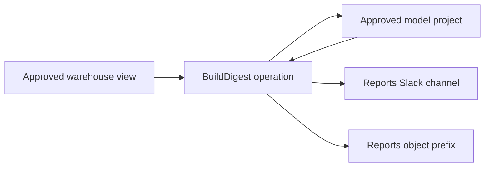

# Resource capabilities and integration plan

Status: **design and integration roadmap**. The common grant, handle, activation,
accounting and administration implementation is documented in
[Resource enforcement](RESOURCE-ENFORCEMENT.md). Future provider designs below
remain proposals. Prepared 2026-09-10. This document
maps the known integration surface and proposes contracts before real providers
are admitted. Example resource names, operation names and budgets are illustrative;
they are not deployed configuration or approved production grants.

## Recommended direction

Use a common grant envelope with **typed resources, separate action facets and
metered usage**. Give each app operation explicitly bound resources. Keep provider
credentials, resource resolution, dispatch and accounting in the host. Give pure
Roc helpers only the resource handles they need.

Three independent questions must have explicit answers:

1. **Authority:** may this actor, app and operation perform this action on this
   particular resource through this connection?
2. **Consumption:** can this request reserve the required money, calls, bytes,
   compute time and concurrency from its shared limits?
3. **Data movement:** what data can this operation obtain, and where can it send
   it? Reading sensitive data and posting to an approved destination independently
   does not prove that the combination is appropriate.

Spending limits fit this design. A model-use grant authorizes the action; its
budget is a consumable constraint checked at admission. The same mechanism also
applies to warehouse queries, SMS, media rendering and provisioned compute.

## Current boundary

The implemented grant and accounting contracts are documented in
[Resource enforcement](RESOURCE-ENFORCEMENT.md) and the currently admitted
provider adapters in [Live integrations](LIVE-INTEGRATIONS.md). Provider designs
below are proposals, not deployment evidence. Company inventories and migration
assessments belong in private repositories.

## The resource and grant model

| Concept | Proposed meaning | Example |
| --- | --- | --- |
| Connection | Host-owned provider account, environment and principal; secret reference and credential mode | Production Snowflake analytics service role; one Slack installation; one actor's Google connection |
| Resource | Provider-qualified, typed target within a connection | Approved query/view; channel/thread; bucket/prefix/object; model deployment; calendar |
| Action facet | Precisely what may be done to the resource | Read messages, post a reply, create an object, summarize text, refund a particular payment |
| Grant | Resource and action authority assigned to an app/operation and eligible actors | Reports may post to the reports channel through its notification operation |
| Limits | Request ceilings and references to durable shared meters | Maximum result bytes, 20 calls/minute, two concurrent calls, USD 100/month |
| Handle | Opaque value carrying a narrower, host-validated grant reference | A reply handle for one thread, or a read handle for one uploaded audio object |
| Receipt | Durable admission/outcome/usage evidence with pinned authority and resource bindings | Which grant authorized an attempt, its provider ID, reservation and final usage |

Resources are a typed hierarchy or graph, rather than an arbitrary string matched
by every adapter. Use immutable provider IDs where available; names are labels.
Where a provider only offers names, pin the account/namespace and define rename,
replacement and drift behavior explicitly. A dropped and recreated object or a
changed view definition must not silently inherit a stronger reviewed contract.

Useful resource families include:

- `DatasetReader(params, row)` and `ApprovedQuery(params, row)`.
- `ChannelReader`, `ThreadReader`, `PostTarget`, `ThreadReply`, `DirectRecipient`.
- `ObjectReader`, `ObjectCreateScope`, `ObjectWriter`, `ObjectDeleter`, `ShareTarget`.
- `TextGenerator`, `EmbeddingGenerator`, `Transcriber`, `ImageGenerator`.
- `DocumentReader`, `DocumentEditor`, `CalendarReader`, `CalendarWriter`.
- `IssueReader`, `IssueCreator`, `IssueUpdater`, `RepositoryReader`, `PullRequestWriter`.
- `CustomerReader`, `SubscriptionUpdater`, `RefundTarget`.
- `DirectoryReader`, `GroupMembershipWriter`, `UserProvisioner`.
- `DeploymentTarget`, `ComputeCreateScope`, `ComputeInstanceControl`.
- `VerifiedEventSource`, `CallbackTarget`, `TimerScope`, `ToolExecutor`.

These are candidate contract families, not an instruction to implement all of
them or force unrelated providers into one identical interface. Share contracts
only when their semantics match; retain provider-specific facets where needed.
For example, a Slack thread reply and an SMS delivery have different receipts,
audiences and retry behavior even though both communicate with someone.

### Rules shared by every family

1. Default deny. Connecting a provider does not grant its resources; listing,
   searching, reading, writing, sharing, deleting and administering are separate.
   Discovery and pagination must respect resource scope too.
2. App code cannot supply a different credential, account, endpoint, role or
   privileged identity through ordinary request arguments. Missing delegated user
   credentials must not silently fall back to a stronger service account.
3. The active authority document binds exact resource definitions or immutable
   versions. Editing desired configuration cannot remap an active alias to a new
   channel, database or principal. Changes in authority require activation.
4. Dynamic selection is permitted only within an authorized parent scope. A
   guessed object ID conveys no authority. An app can request a narrower child
   handle; it cannot create one by assembling JSON.
5. Child grants can only narrow resource sets, actions, expiry and per-call limits.
   They share the parent's accounting ledger. Copying a handle or spawning work
   does not duplicate a budget. Cross-app delegation requires both sides' explicit
   authority and authenticated subject/initiator provenance.
6. Created resources return scoped handles. Permission to create a report object
   under a prefix does not imply permission to read every existing object or change
   bucket policy. Creation and later control need separate explicit semantics.
7. Every provider attempt, including retries and deferred work, requires current
   admission. An SDK retry hidden inside an adapter must not escape that boundary.
8. Unknown operations, resource schemas and contract versions fail closed. New
   provider tools and newly discovered resources do not automatically gain grants.
   Membership in a deliberately dynamic container, such as a prefix, is an explicit
   exception whose future-content implications must be part of the grant.
9. Cache entries, cursors, exports, callbacks, uploaded files and generated
   artifacts retain resource/subject provenance. For strict current-authority
   checks on download, retain a host-checked handle and proxy access. Exposing a
   bearer signed URL instead delegates access until its expiry or effective
   provider revocation; that weaker revocation boundary must be explicit.
10. Capability issuance, privileged sharing and credential administration are
    distinct operations. A provider administrator credential stays outside ordinary
    app code even when a particular app is allowed a narrow provisioning action.

## Three initial integration designs

### Snowflake and other databases

Start with **approved parameterized query contracts over explicitly granted
objects**, preferably curated views. Use secure views when the view itself is a
confidentiality boundary: ordinary Snowflake views can expose hidden information
through optimizer behavior. See [secure views](https://docs.snowflake.com/en/user-guide/views-secure).
An app might receive access to a customer
funnel query with a bounded date range, a specific result schema and a tenant scope
derived from trusted identity. It gets no access to other tables by default.

Each grant identifies the account, database/schema, object/query versions,
execution role, warehouse, permitted parameters, projected columns, row-policy
source, result limits, timeout and concurrency. App-supplied tenant IDs must be
checked against host-authorized scope. A hardcoded WHERE clause supplied by an app
is not a security boundary. Do not fetch all rows and filter them in Roc.

Use a narrowly privileged provider role as a second boundary. Snowflake separates
object `SELECT`, namespace/warehouse `USAGE`, writes and administration. Check
effective inherited and `PUBLIC` privileges. Native row policies can further
restrict returned rows; their availability and semantics must be verified for the
installation. See [Snowflake privileges](https://docs.snowflake.com/en/user-guide/security-access-control-privileges)
and [row access policies](https://docs.snowflake.com/en/user-guide/security-row-intro).

A SELECT-only check is insufficient: SQL can invoke functions, including paid AI
functions. Review permitted functions, external functions, procedures, exports and
session/role changes independently. Snowflake currently documents Cortex privileges
available through `PUBLIC`; effective grants need inspection. See
[AI function access](https://docs.snowflake.com/en/user-guide/snowflake-cortex/aisql-privileges-and-access).

Result limits bound disclosure and response size, not scanned data or compute.
Use fixed warehouse choices, statement/queue ceilings and concurrency limits.
Resource monitors are a useful backstop but are not precise credit caps and do not
cover every serverless/cloud-services charge. See
[warehouse controls](https://docs.snowflake.com/en/user-guide/cost-controlling-controls)
and [resource monitor limits](https://docs.snowflake.com/en/user-guide/resource-monitors).

Snowflake Restricted Session Scope is a promising additional privilege ceiling,
but its agent context does not apply automatically to ordinary third-party
key-pair/PAT connections. Qualify the actual connection path before depending on
it. See [Restricted Session Scope](https://docs.snowflake.com/en/user-guide/restricted-session-scope).

Freetool and Agent Gateway expose a real future need for interactive queries.
Keep that as a separate, broader capability with its own SQL grammar, namespace,
function, query-plan and cost controls. Do not quietly widen every fixed reader to
arbitrary SQL. An approved query definition is versioned admitted code; business
analysis remains explicit in app/query contracts rather than hidden in Rust.

### Slack and other messaging

A Slack resource includes installation/workspace and conversation IDs. A thread
also includes its parent timestamp. Separate these facets:

| Capability | Authority it conveys |
| --- | --- |
| Channel metadata/discovery | See approved channel names and metadata |
| Channel history | Read bounded history from one channel |
| Thread history | Read one thread, with independent paging/time limits |
| Channel post | Publish a new message to one channel |
| Thread reply | Reply within one thread; broadcast is separately controlled |
| Direct recipient | Send to one authorized person or a bounded directory-derived set |
| Message edit/delete | Change permitted messages, normally those created through this grant |
| Files | Separate metadata, download, upload, share and deletion actions |
| Profile/status, groups, channels, modals | Separate resource types for the apps that actually need these actions |

OAuth scopes are a provider ceiling, not the per-channel Day2 policy. Slack history
access depends on token type, scopes and membership. Its `chat:write.public` can
permit broad public-channel posting, and `chat:write` can start an app DM when a
user ID is supplied. The adapter must validate the exact destination and message
options. See [history access](https://docs.slack.dev/reference/methods/conversations.history/)
and [posting semantics](https://docs.slack.dev/reference/methods/chat.postMessage/).

Channel reads must not implicitly authorize every file the token can download;
Slack's `files:read` covers metadata and downloads. Convert verified interaction
response URLs into host-held, expiring reply handles: Slack documents that these
URLs bypass channel posting permissions. See [file scope](https://docs.slack.dev/reference/scopes/files.read/)
and [interaction replies](https://docs.slack.dev/interactivity/handling-user-interaction/).

A signed Slack event is authentic input, not permission to perform arbitrary app
actions. The ingress adapter binds workspace, source, actor and resource before
admitting the command. Channel membership and Slack Connect audiences can change;
a channel ID grant is not a permanent guarantee about the people who will see it.

For Reports, a narrow semantic `ReportReadyTarget` could be preferable to general
message text: the host formats a fixed notification from an authorized report
reference and validates the destination audience's access to the report and the
metadata being disclosed. Links should still require reader authorization; a bearer
link is itself a sharing grant. General channel posting remains appropriate for
apps whose purpose requires arbitrary content.

### OpenAI and other model providers

This proposal treats “ChatGPT” as an OpenAI API integration. The resource is a
host-bound provider project/deployment and approved model/operation profile. It
is accompanied by a budget account and explicit input/retention constraints.
No particular model or current price is selected here.

An illustrative grant could allow a report summarizer to use one approved text
model, at most 20,000 input tokens and 2,000 output tokens per request, with USD
0.25 per invocation, USD 100 per app/month and two concurrent requests. Those are
example policy choices, not provider prices or recommended production allocations.

Separate text generation, embeddings, audio transcription, speech, image/video
generation, batch work, fine-tuning, file uploads and persistent vector stores.
Different operations consume different units and create different provider state.
Input includes instructions, history, tool schemas and attached content. Model
fallbacks, service tiers and context-dependent pricing cannot silently escape the
approved rate model.

Current OpenAI documentation distinguishes spend alerts from enforceable monthly
organization/project limits. Enforcement is not instantaneous and tracked spend can
slightly exceed a configured cap. Use verified provider enforcement as a backstop,
alongside our finer admission ledger. See [OpenAI spend limits](https://developers.openai.com/api/docs/guides/spend-limits).

OpenAI's spending-controller example uses pre-request reservation and settlement,
and keeps uncertain charges reserved. Its scope excludes hosted tools and other
charges; that is also a useful reason to begin our implementation with a bounded
text-only contract. See [per-run spending controller](https://developers.openai.com/cookbook/articles/per_run_spending_controller_responses_api).

A model-use grant conveys no tool authority. A generated tool call is untrusted
data that must go through an independently authorized operation. Bound tool rounds,
fan-out, retries and cumulative spend across the entire invocation tree. Hosted
search, remote MCP, file search, code execution and browser use each need explicit
tool/resource grants and cost treatment.

Sending a prompt is an external disclosure even if the response is never saved.
Use approved provider/data-processing profiles and deliberately bounded inputs.
An app-declared label such as `non_sensitive` is not proof of the actual content.
Provider retention controls need separate qualification; do not infer a retention
guarantee from the purity of Roc code.

## Durable consumption accounting

Keep quota policy separate from accounting state. Authority activation can change
future limits but must not erase spent money or outstanding reservations.

For a request whose cost can be conservatively bounded, the host computes a quote
under a versioned rate card and reserves against all applicable accounts:

```text
settled consumption + outstanding reservations + new reservation <= limit
```

Use exact integer/rational arithmetic and round reservations upward. Request
counts, returned bytes, tokens, SMS segments, media seconds, instance minutes and
money are separate units. A dollar budget does not replace a concurrency limit.

Within an app database, extend the short dispatch-admission transaction to:

1. Check the invocation's active authority stamp, operation, resource and verb.
2. Validate the fully bound payload and compute its usage reservation.
3. Reserve all applicable local budget/rate/concurrency counters atomically.
4. Journal the attempt, resource/grant versions, payload binding and reservation.
5. Commit, then dispatch using the existing private permit mechanism.

Apply the same resource and meter gate to preparation's observation-admission
transaction. An Observe contract is a business read; it can still disclose request
data, consume provider compute or incur charges. Classify provider operations by
their actual semantics rather than their HTTP method.

No business database transaction stays open during the provider request. Record
actual usage and release unused reservation idempotently when evidence arrives.
Settlement still runs for already admitted work after revocation; it cannot revive
an app invocation or mint new authority. A provider error is not automatically a
zero-cost outcome. A timeout or missing final usage retains the conservative hold;
reconcile, or charge the upper bound where the contract permits it. Blindly
releasing the hold and retrying can spend the same allowance twice.

Bind quotation, preflight and dispatch to the same immutable request. A token-count
preflight that transmits content is itself an admitted external disclosure; its
usage needs accounting if it is billable. If actual liability exceeds the reserved
maximum, record the full amount and freeze further use pending reconciliation.
Never clamp the recorded charge to preserve the appearance of a passing budget.
An admitted reservation must not expire merely because a local lease or request
timeout elapsed. Operation deduplication also does not automatically prove billing
deduplication: reserve each potentially chargeable physical attempt.

For example, with USD 0.20 left and two concurrent requests each reserving USD 0.15,
only one can be admitted. Separate workers must not both observe the old balance
and proceed. Copying a handle must continue to debit the same account.

Per-request and per-invocation budgets supplement persistent actor/app/connection
budgets. A caller cannot gain more authority by opening new invocations. Use trusted
host admission time for rate/billing windows, define boundaries explicitly, and
keep old-window reservations until settled. Lowering a cap below existing usage
blocks new work; it does not cancel historical charges.

### Company-wide limits and restoration

Each app currently has a separate database. A sum displayed on a dashboard cannot
enforce a company-wide cap atomically. Choose one of these mechanisms before making
that guarantee:

- **Initially: disjoint allocations.** Allocate fixed per-app shares whose sum fits
  the parent budget. No automatic borrowing. Outstanding holds count before shares
  can be reclaimed or reassigned. Debit the durable allocator before crediting an
  app, using a unique transfer ID bound to the app database epoch and period. Fence
  the old allocation before reissuing capacity. A failed transfer may strand funds
  until reconciled, but must not duplicate them.
- **Later: shared reservation authority.** A durable company meter or escrow
  allocator issues single-use reservations. Obtain the global reservation, then
  bind/consume it through local admission. Failures may strand capacity until
  reconciled; they must never allow duplicate spending. This is a coordinated
  protocol, not a new cross-database ACID guarantee.

The first option also needs a durable owner of allocations. Restoring an older
app database must not restore money already spent at the provider. Restores remain
disabled until charges and holds are reconciled or a fresh allocation is issued
from a surviving ledger. Rotating the authority epoch does not reset billing.

Specify whether a period budget covers admissions in that period or charges billed
in that period. Those differ across month-end. Keep unresolved liability available
to reconciliation across period boundaries; a fresh calendar window must not erase
an old hold or misrepresent a cap on provider-billed spending.

Strict admission limits are only as strong as the cost upper bound and exclusive
dispatch path. Provider billing delays, price changes and out-of-band use of the
same credential can defeat an exact invoice ceiling. If the cost cannot be
bounded, report an explicitly best-effort budget and use provider backstops, or
deny the operation under a strict-budget grant. Never label an estimate a hard cap.

Provisioned pods, phone calls, stored files and background provider jobs can keep
costing money after a request returns. They need lifetime reservations, resource
counts, renewals, cleanup and reconciliation. Expiring a capability does not stop
a VM or refund its costs. A separate, narrow host cleanup authority must be able
to terminate tracked resources after app revocation without granting the app new
provisioning power.

## App and platform interface shape

The public query/command and Observe/Effects/Tx phases remain suitable. Add typed
resource binding at operation construction/registration. The exact Roc syntax
needs a sealed-SDK design and compiler check; the following signatures describe
the proposal, not available APIs:

```roc
Data.read : Data.Reader(params, row), params -> Observe(CollectionPage(row))
Text.generate : Text.Generator, Prompt -> Effects(GeneratedText)
Messages.post : Messages.PostTarget, Message -> Effects(MessageReceipt)

summarize : Text.Generator, FunnelSummary -> Effects(GeneratedText)
announce : Messages.PostTarget, GeneratedText -> Effects(MessageReceipt)
render : FunnelSummary -> Message
```

An operation declares its typed needs, and the host binds them from activated
authority. A factory can receive those bindings and return the existing handler
signature, avoiding a required extra parameter on every handler:

```text
BuildDigest needs:
  funnel        : Data.Reader(FunnelParameters, FunnelRow)
  summarizer    : Text.Generator
  announcements : Messages.PostTarget

BuildDigest(funnel, summarizer, announcements) -> existing phased handler

prepare:    read funnel with bounded parameters
decision:   compute the report inputs in pure Roc
effects:    summarize, then post the result to announcements
completion: persist the receipts and business outcome in Tx
```

The app describes this sequence as pure programs. No raw SQL connection, HTTP
client, Slack token or model API key enters Roc. The summarizer receives only the
model handle; the announcer receives only the destination handle; the renderer
receives ordinary data. Billing and admission happen in the host.

That narrowing is a useful API property only if helpers cannot reacquire broader
authority through a global resolver, captured Context or another public SDK path.
Generated binding factories must stay at the operation entry point. The host must
also validate handles independently, including app/invocation, resource, action,
lineage and current stamp. Opaque Roc types alone cannot authenticate a wire value.
The security principal remains the app/invocation: hostile helper isolation would
require a separately enforced module or execution boundary.

Illustrative authority configuration, not a proposed final JSON schema:

```json
{
  "resources": {
    "funnel_reader": {
      "kind": "dataset_reader",
      "connection": "analytics_readonly_v3",
      "query_contract": "customer_funnel_v2",
      "limits": { "max_rows": 100, "max_bytes": 65536, "timeout_ms": 5000 }
    },
    "report_summarizer": {
      "kind": "text_generator",
      "connection": "report_model_project_v1",
      "model_profile": "approved_summary_model_v1",
      "limits": { "max_input_tokens": 20000, "max_output_tokens": 2000 },
      "budget_accounts": ["reports_ai_monthly", "invocation_ai"]
    },
    "report_announcements": {
      "kind": "message_post_target",
      "connection": "company_slack_bot_v2",
      "workspace_id": "T_EXAMPLE",
      "channel_id": "C_REPORTS",
      "limits": { "max_message_bytes": 8000, "broadcast": false }
    }
  },
  "operation_resource_grants": {
    "build_digest": {
      "funnel": "funnel_reader",
      "summarizer": "report_summarizer",
      "announcements": "report_announcements"
    }
  }
}
```

Each resource kind determines allowed actions; broader multi-action resources must
list facets explicitly. Existing actor/mode/model/command policy remains in force
and is omitted above for readability. Resource and budget IDs resolve through the
same installation and active authority model, with typed contract validation.
Provider bindings belong to the company installation, and contract definitions
belong to admitted packs; do not create a second company configuration registry.

The implementation would change the capability policy schema, artifact admission,
sealed SDK bindings, host resource resolver and dispatch journals. Apps only change
where they declare/use an integration. Local-only apps need no invented provider
dependencies. The existing notification contract can be the first migration case,
preserving its current invoking-actor restriction while expressing it explicitly.

## Data movement and the pure-app guarantee

Generate a reviewable graph from operation declarations and activated grants:



This graph describes possible access and disclosure paths. It does not prove which
values flow along them. If one operation can read payroll and post publicly, the
combination permits a payroll disclosure even if each grant is individually valid.

For sensitive workflows, narrow the data at its source, split operations/principals
where that actually removes authority, and offer semantic operations such as
`send_report_ready(report_reference)` instead of arbitrary text. Broader automatic
data-flow guarantees would require protected data wrappers or information-flow
tracking and a separately reviewed declassification model. Do not claim that
ordinary strings, user-applied labels or prompt instructions provide this.

Roc app evaluation can stay pure: effects are descriptions interpreted by a trusted
host, with authority checked at each boundary. That does not make the overall
system free of effects, bills, information disclosure, unsafe message content,
provider drift or host/adapter bugs. Revocation prevents future admissions; it
cannot unsend a message, undisclose a prompt or necessarily stop admitted work.

## Provider pack acceptance contract

Before enabling any real provider, define and independently exercise:

- Typed resource identity, normalization, resolution, action facets and minimum
  provider permissions; no unrestricted credentials or network escape path.
- Authenticated subject/delegation and credential selection, including denial on
  missing user credentials and no broader fallback.
- Complete request/response bounds and permitted provider subrequests, redirects,
  polling, retries, background work and persistent artifacts.
- Successful, rejected and unknown outcomes; provider deduplication or verified
  reconciliation for writes. A host effect ID alone cannot promise exactly-once
  behavior from an arbitrary provider.
- Usage quotation, rate-card version, reservation, settlement, uncertain charges,
  audit redaction and recovery across process restart and authority changes.
- Tests for cross-resource substitution, resource discovery leakage, stale handles,
  cross-app/actor reuse, replay, pagination, delegated widening and concurrent
  exhaustion. A denied action must produce no unadmitted provider request.
- A deterministic simulator plus provider conformance evidence. Source inspection
  and mocks are useful but do not qualify actual provider credentials or behavior.

For inbound integrations, also bind verified signatures/audience, installation,
resource, replay identity and time limits. For generic HTTP/MCP/browser facilities,
enumerate indirect authority explicitly: redirects, subresources, downloads,
network destinations, authenticated browser state and tool schemas. A tool's
name or self-declared read-only annotation is not an authorization proof.

## Delivery sequence

1. **Catalog and contracts:** agree on this envelope, populate the known integration
   map, define typed needs and exact binding/attenuation semantics. Record future
   packs as planned and default off. Preserve the current phase model.
2. **Resource enforcement foundation:** activate resource bindings transactionally;
   issue scoped handles; journal resource provenance; migrate local Notifications
   without weakening recipient checks. Prove stale and substituted handles fail.
3. **Three real vertical slices:** an approved Snowflake reader, a single-channel
   Slack sender/reader and synchronous bounded text generation. Implement durable
   local reservations before the first billable action under a strict-budget
   grant, including reads. Qualify real provider controls and failure cases for
   each slice; clearly label provider costs that only have best-effort bounds.
4. **Reuse across app migrations:** object/media handles, Google documents/calendar,
   Linear/GitHub, telephony/push and signed ingress. Include Sessions and Oncall to
   exercise artifacts, polling and later authenticated events. Storage, calls and
   background jobs require their corresponding lifetime accounting and cleanup
   before activation.
5. **Higher authority:** billing mutations, identity provisioning, infrastructure,
   browser/agent execution and broad interactive querying. Use synthetic directory and
   Wonderpod for partial failure, resource lifecycle and recovery evidence. Any
   required human authorization is a scoped, expiring record bound to the exact
   action; it never substitutes for execution-time resource checks. Compute
   lifetime reservations and post-revocation cleanup precede live provisioning.
6. **Shared economics and stronger data controls:** shared/escrow company budgets,
   richer accounting, data-flow restrictions and credential lifecycle hardening
   where the concrete integrations justify them. Earlier stages use fixed budget
   allocations and the accounting required by their enabled operations.

The immediate architecture decision is to establish these contracts and enforcement
points before implementing broad adapters. Provider account IDs, approved datasets,
channel audiences, data-processing profiles and actual budget allocations remain
installation choices to resolve before enabling the corresponding integration.
