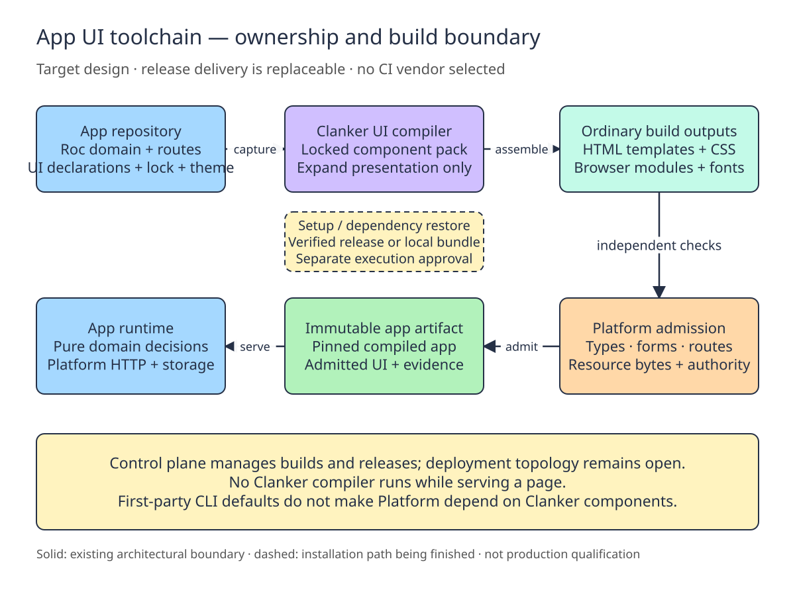
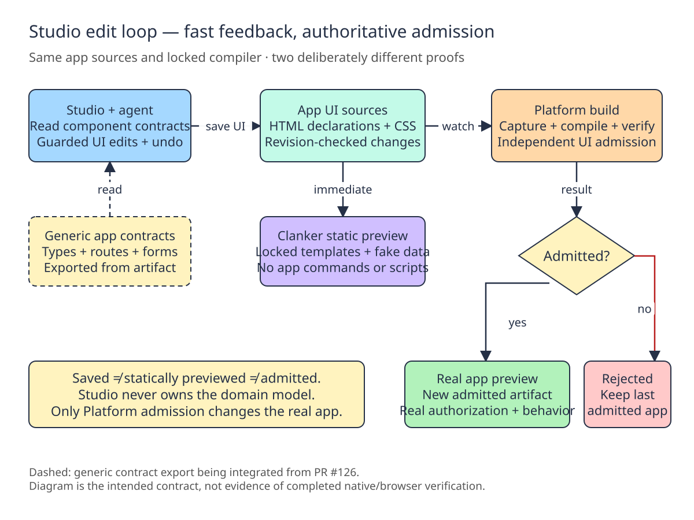

# UI toolchain drawings

Editable Excalidraw sources for the first-party UI toolchain design. Import the `.excalidraw` files into Excalidraw, or open the encrypted share links below. These contain architectural roles only, not private app data or operator configuration.

- [Ownership and build boundary](https://excalidraw.com/#json=WhX34jkvwh4NNKfPHxlW6,g0J9Om-2gX13EKKn7Zq-WA): [`ui-build-boundary.excalidraw`](ui-build-boundary.excalidraw).
- [Studio edit and admission loop](https://excalidraw.com/#json=z0E4LgSLYJE5puAE7w8UL,nwUy5tHIyuKb-zhVu8GSFA): [`studio-edit-loop.excalidraw`](studio-edit-loop.excalidraw).

## PR/TDD image previews

The SVGs are companion static previews; edit the Excalidraw sources and keep both views synchronized.

## Reading the drawings

The build drawing records the intended generic boundary: app owns domain and UI declarations, producer expands presentation, Platform independently admits output, and the runtime serves pinned artifacts without a producer compiler. Setup/restore remains separate from execution approval. No CI vendor, deployment topology, registry service or production containment is selected by this drawing.

The Studio drawing distinguishes saved source, static fake-data preview and a real admitted app. Static preview is not proof of domain execution or admission. Rejection retains the last admitted app. Generic artifact contract export was integrated from PR #126; native/GUI acceptance remains a separate gate.

Solid boundaries describe the architectural division; dashed notes mark integration/release work. Neither drawing is an assertion that native/browser/full-gate verification or hosted publication is complete.

For reviewed handoffs, actual scoped evidence and remaining gates, see [the implementation checkpoint](../../UI-TOOLCHAIN-TDD.md). For the scoped implementation plan and acceptance gates, see [`finish-first-party-ui-toolchain`](../../../openspec/changes/finish-first-party-ui-toolchain/design.md).
